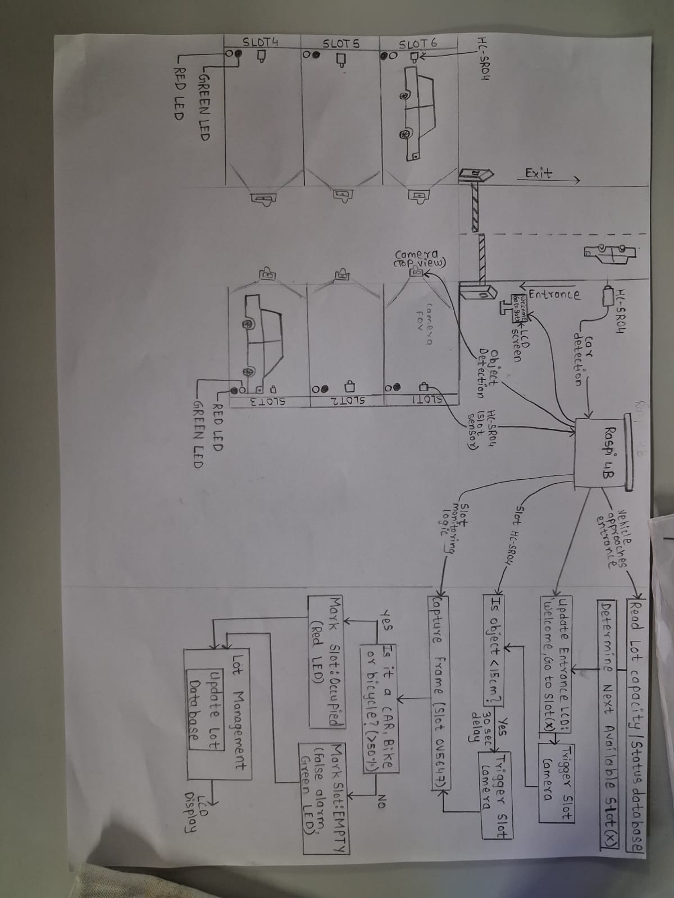
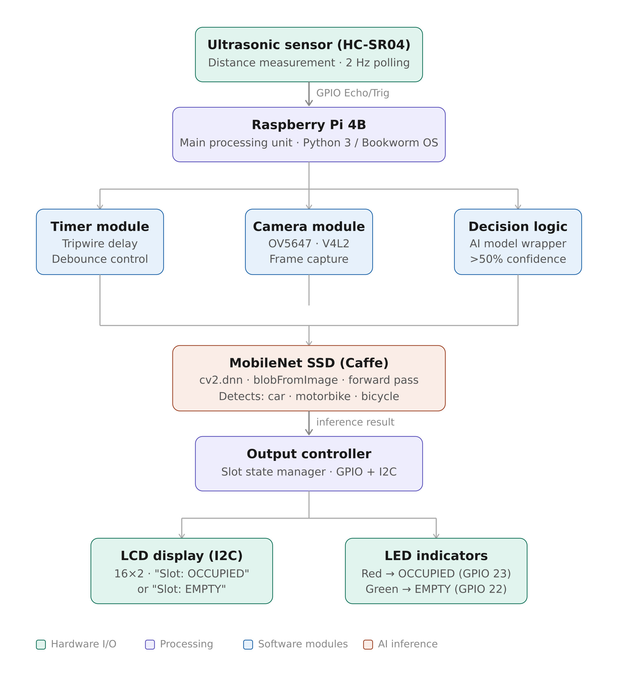
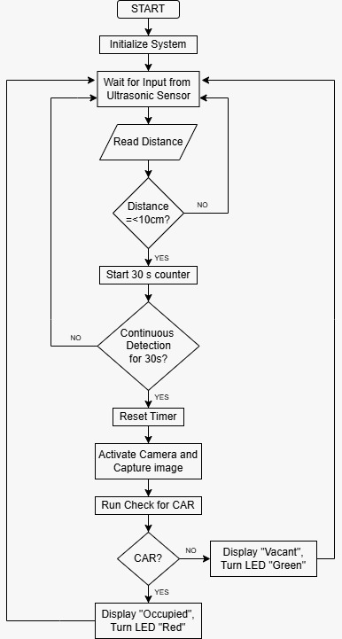
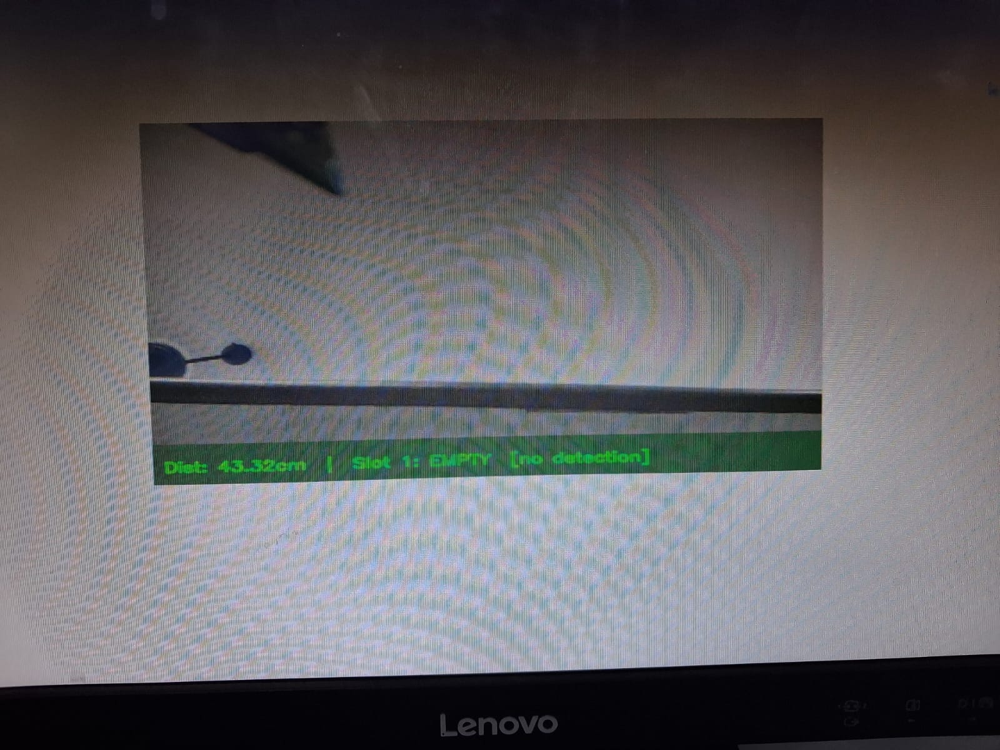
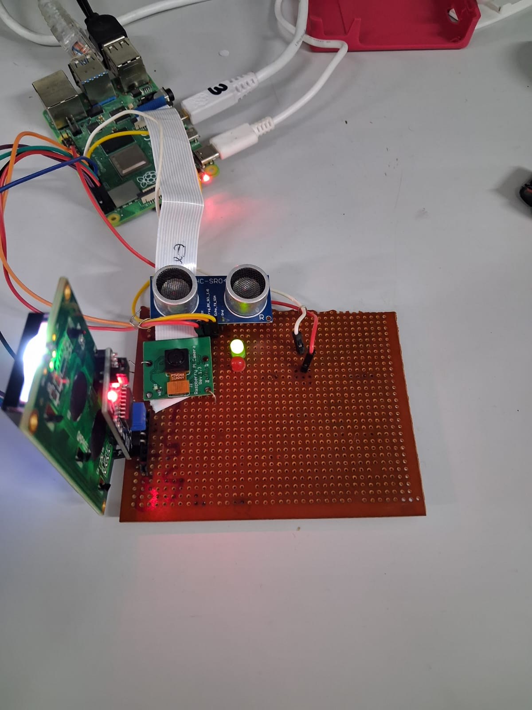
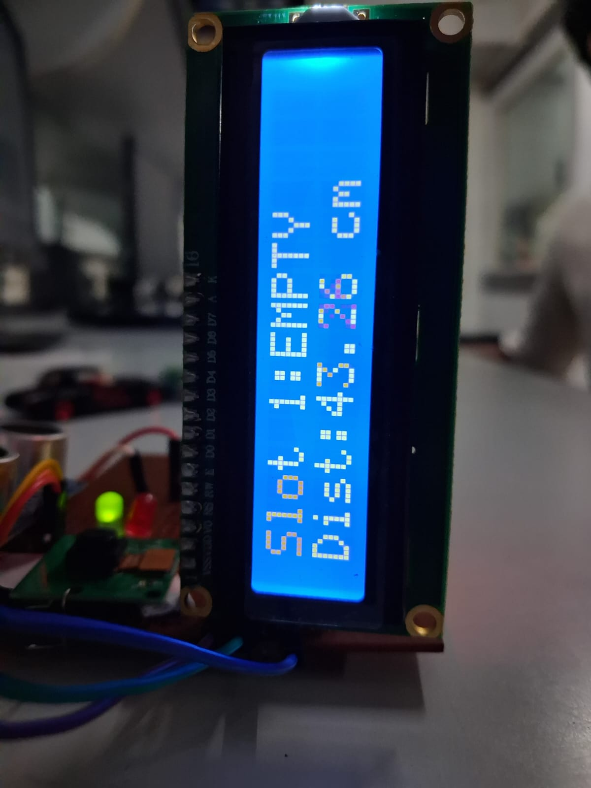
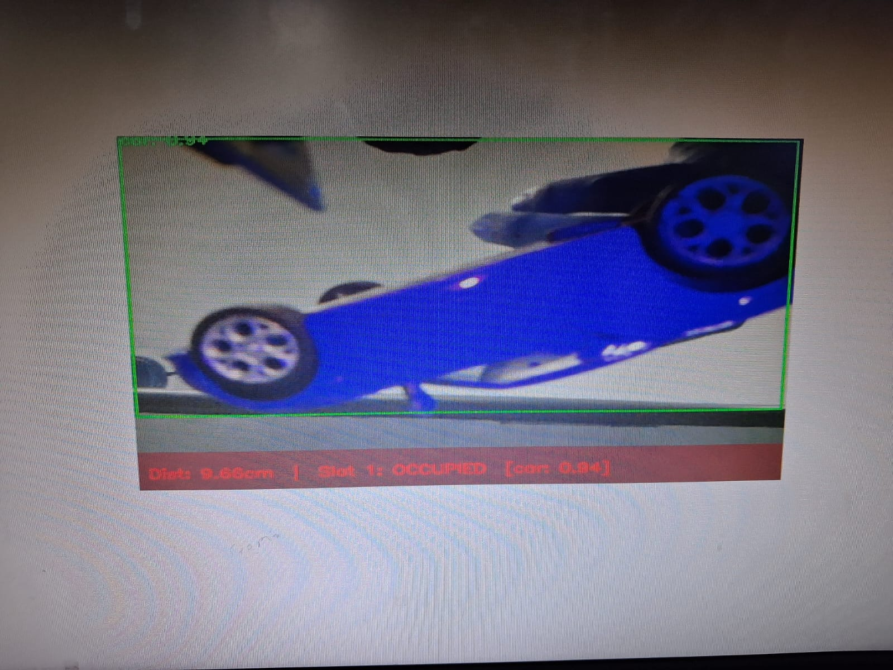
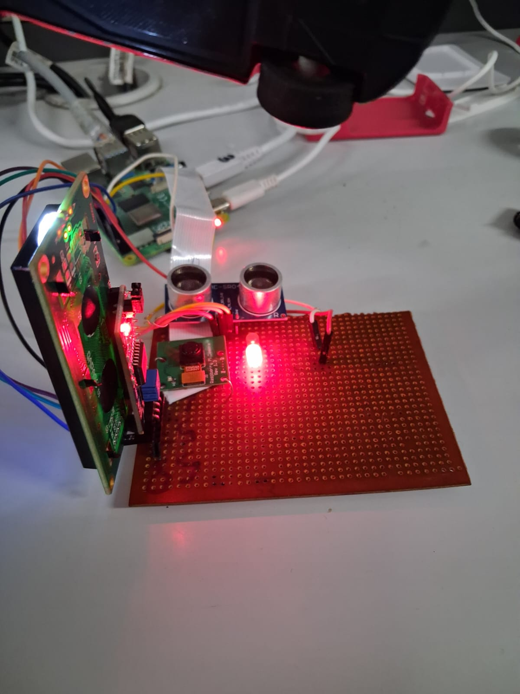
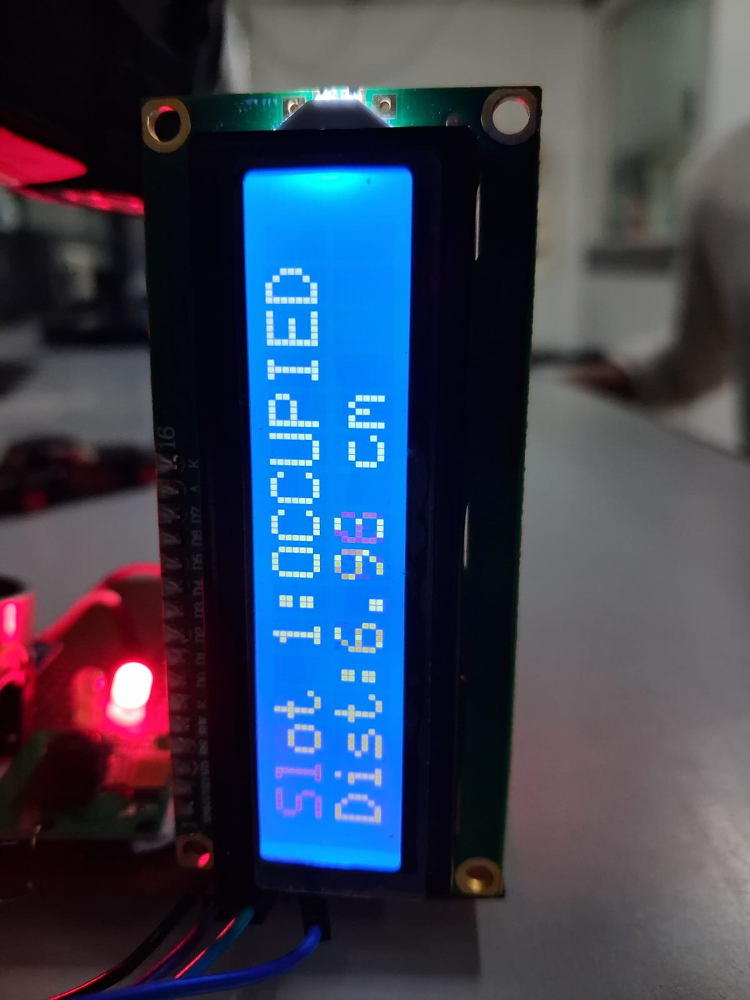

# SKILL LAB PRATICAL HACKATHON

## Final Project README

> **Project Weight:** 100%  
> **Team Size:** 4/3 students  
> **Project Duration:** 16 hours  
> **Total Time Available:** 32 effort-hours per team  
> **Project Type:** Playful, interactive, technology-based experience

---

# Before you begin

## Fork and rename this repository

After forking this repository, rename it using the format:

`SKILLLAB_PROR-2026-TeamName`

### Example

`SKILLLAB_PROR-2026-AuroWizards`

Do not keep the default repository name.

---

# How to use this README

This file is your team’s **working project document**.

You must keep updating it throughout the build period.  
By the final review, this README should clearly show:

- your idea,
- your planning,
- your design decisions,
- your technical process,
- your build progress,
- your testing,
- your failures and changes,
- your final outcome.

## Rules

- Fill every section.
- Do not delete headings.
- If something does not apply, write `Not applicable` and explain why.
- Add images, screenshots, sketches, links, and videos wherever useful.
- Update task status and weekly logs regularly.
- Use this file as evidence of process, not only as a final report.

---

# 1. Team Identity

## 1.1 Studio / Group Name

`Team ParkerS`

## 1.2 Team Members

| Name              | Primary Role                  | Secondary Role | Strengths Brought to the Project |
| ----------------- | ----------------------------- | -------------- | -------------------------------- |
| Dhriti Mohata     | [Electronics / Fabrication]   | [Documentation]| Material Handling, Hardware      |
| Sairaj Indulkar   | [Electronics / Fabrication]   | [Coding]       | Material Handling,Hardware       |
| Vivek Thakare     | [Electronics / Fabrication]   | [Coding]       | Material Handling, Hardware      |
| Werda Wasey       | [Electronics / Coding]        | [Documentation]| Software                         |

## 1.3 Project Title

`Smart Parking System`

## 1.4 One-Line Pitch

`A smart parking system that detects and displays real-time slot occupancy using sensors and camera-based verification.`

## 1.5 Expanded Project Idea

`This project presents a Smart Parking System that combines sensor-based detection with camera-assisted verification to efficiently manage parking spaces. Each parking slot is equipped with an ultrasonic sensor that continuously monitors the presence of an object. When an object is detected, the system triggers a camera module connected to the Raspberry Pi 4 Model B to capture an image and classify whether the object is a vehicle (car/bike) or a non-relevant object such as a human. Based on this classification, the system updates the slot status as occupied or vacant and stores this information in a real-time availability table. This hybrid approach improves accuracy by reducing false detections and optimizes computational efficiency by activating the camera only when necessary. The system is scalable and can be extended with IoT integration, mobile applications, and number plate recognition for smart city implementations.`

---

# 2. Inspiration

## 2.1 References

| Source Type | Title / Link                                                        | What Inspired You                                                                         |
| ----------- | ------------------------------------------------------------------- | ----------------------------------------------------------------------------------------- |
| `[Reference code]`   | `https://github.com/djmv/MobilNet_SSD_opencv` | `Provided the core reference for integrating the MobileNet SSD Caffe model with OpenCV's DNN module, demonstrating how to efficiently process image frames and filter for vehicle classes in real-time` |
| `[Video]`            | `https://youtu.be/Vfo7DS7-D-0?si=bgHEID2KTqGmmKqK` | `Demonstrated the core visual logic of tracking parking slot occupancy using a top-down camera feed and computer vision, inspiring the object detection approach for marking slots as "OCCUPIED" or "EMPTY" in my physical prototype`             |

## 2.2 Original Twist

Honestly, most edge-AI projects we looked at just blast the camera feed 24/7. When you do that on a Raspberry Pi, it gets crazy hot, throttles the CPU, and wastes a ton of power. On the flip side, the basic, cheap parking systems just use ultrasonic sensors, but those are kind of dumb—if a person walks by or someone drops a box in the spot, the sensor gets blocked and flags the slot as "occupied."

Our original twist is mashing both approaches together to cover each other's flaws. We're using a "Sensor Fusion" tripwire method. The Pi's camera actually stays asleep most of the time to save resources. The system only relies on the low-power ultrasonic sensor polling in the background.

It’s only after the ultrasonic sensor detects an object within 15cm that it wakes up the camera and runs the heavy MobileNet AI model. Basically, the ultrasonic sensor asks "Is something there?" and the AI wakes up just long enough to answer "Is it actually a vehicle?" It makes the system way more thermally efficient for the hardware while completely killing the false-alarm problem.

---

# 3. Project Intent

## 3.1 User Journey 

A driver enters a parking area looking for a place to park his car. Instead of guessing or driving around aimlessly, he notices a display board at the entrance showing the current status of parking slots. It clearly indicates how many slots are occupied and how many are available. As a car leaves a slot, the system instantly updates—changing the slot status from occupied to vacant using sensor detection and camera verification. The user quickly checks the display, sees that a slot is free, and parks his car without confusion or delay. Once he parks, the system detects his car, verifies it, and updates the display again to reflect the new occupancy. This continuous real-time update ensures that every user gets accurate parking information, making the process faster, more efficient, and hassle-free.                                

# 4. Definition of Success

## 4.1 Definition of “Usable”

A usable smart parking system is one that can reliably detect whether a parking slot is occupied or vacant and clearly display this information to users in real time. The system should respond quickly to changes, such as a vehicle entering or leaving a slot, and update the display without noticeable delay. It must be simple to understand, with clear indicators (LED or LCD) so that users can easily identify parking availability without confusion. Even with a limited number of slots, the system should function accurately and consistently under normal conditions.

## 4.2 Minimum Usable Version

The minimum usable version of the project consists of a basic setup with at least one or two parking slots monitored using ultrasonic sensors. Each slot should have an indicator (such as red and green LEDs) to show whether it is occupied or vacant. A central controller like the Raspberry Pi 4 Model B processes the sensor data and updates a simple LCD display showing the total number of available and occupied slots. This version does not require a dashboard but must demonstrate accurate detection and real-time updates.

## 4.3 Stretch Features

Stretch features extend the system and make it more intelligent and scalable. These include integrating a camera module to classify detected objects and reduce false positives, adding a database or cloud connectivity to store parking data, and developing a mobile or web application to remotely view slot availability. Additional enhancements can include number plate recognition, automated entry logging, and integration with smart city infrastructure. These features improve accuracy, usability, and real-world applicability of the system.

---

# 5. System Overview

## 5.1 Project Type

Check all that apply.

- [x] Electronics-based

- [ ] Mechanical

- [x] Sensor-based

- [ ] App-connected

- [ ] Motorized

- [ ] Sound-based

- [ ] Light-based

- [x] Screen/UI-based

- [ ] Fabricated structure

- [x] Game logic based

- [ ] Installation

- [ ] Other:

## 5.2 High-Level System Description

**Input:** 
The system takes input from ultrasonic sensors installed in each parking slot. These sensors detect the presence of an object by measuring distance. When an object is detected, the camera module is triggered to capture an image for verification.

**Processing:**
A central controller, such as the Raspberry Pi 4 Model B, processes the sensor data. If the ultrasonic sensor detects an object, the system activates the camera and classifies whether the object is a vehicle (car or bike) or something else. Based on this classification, the system decides whether the slot should be marked as occupied or vacant. The status of each slot is then stored in memory and updated continuously.

**Physical Structure:**
The setup consists of a small parking model with defined slots. Each slot is equipped with an ultrasonic sensor and LEDs. A camera module is positioned to capture images of the slots when triggered. All components are connected to the central controller through wires and mounted on a base structure.

**Output:**
The system displays the parking status using LEDs and an LCD display. Each slot has a visual indicator (red for occupied, green for vacant), while the LCD shows the total number of available and occupied slots in real time.

## 5.3 Input / Output Map

| System Part | Type | What It Does |
| :--- | :--- | :--- |
| **HC-SR04 Ultrasonic Sensor** | Input | Continuously polls distance to act as a hardware tripwire (triggers at < 15cm). |
| **OV5647 Camera Module** | Input | Captures high-resolution image frames when triggered for AI object detection. |
| **16x2 I2C LCD Display** | Output | Displays real-time text feedback to the driver ("Slot: OCCUPIED" or "Slot: EMPTY"). |
| **Green LED** | Output | Provides high-visibility visual confirmation that the parking slot is available. |
| **Red LED** | Output | Provides high-visibility visual confirmation that the parking slot is taken. |

---

# 6. System Design, Sketches and Visual Planning 

## 6.1 Labeled Build Sketch/architecture/flow diagram/algorithm

**Insert image below:**  

## 6.2 Approximate Dimensions

| Dimension        | Value   |
| ---------------- | ------- |
| Length           | `16 cm` |
| Width            | `16 cm` |
| Height           | `8 cm`  |
| Estimated weight | `400 g` |

---

# 7. Electronics Planning

## 7.1 Electronics Used

| Component                 | Quantity | Purpose                               |
| ------------------------- | --------:| ------------------------------------- |
| `[Raspberry Pi 4B]`       | `1`      | `[Main controller]`                   |
| `[HC-SR04 Ultrsonic sensor]`| `1`      | `[Acts as the "low-power" trigger; measures distance to detect an arriving vehicle within 15cm]`      |
| `[I2C 16x2 LCD Display]`    | `1`      | `[Provides real-time visual feedback]`|
| `Rpi camera `             | `1`      | `[Captures image frames for object detection when triggered by the "tripwire."]` |

## 7.2 Wiring Plan

The Raspberry Pi 4B is connected to the 3.3V-compatible ultrasonic sensor (HC-SR04) using two GPIO pins. The trigger pin (Trig) is connected to GPIO 17 to send the polling signal, and the echo pin (Echo) is connected directly to GPIO 27 to safely receive the return pulse without needing a voltage divider. The camera module (OV5647) handles image capture separately and is connected directly to the Pi using the dedicated CSI ribbon cable port.

The system's visual feedback is handled by an I2C LCD and two 3.3V status LEDs. The 16x2 LCD uses two dedicated I2C pins: the data line (SDA) is connected to GPIO 2, and the clock line (SCL) is connected to GPIO 3. The status LEDs are connected to standard GPIO pins, with the green LED connected to GPIO 22 and the red LED connected to GPIO 23.

Power distribution is split based on the components' specific voltage requirements. The LCD display is powered by the Pi's 5V supply pin, while the ultrasonic sensor receives regulated power from the Pi's 3.3V supply pin. The LEDs operate safely on the 3.3V logic provided directly by their assigned GPIO pins. All components share a common ground with the Raspberry Pi to ensure stable logic levels and reliable system operation.

## 7.3 Circuit Diagram/architecture diagram

Insert a hand-drawn or software-made circuit diagram.

**Insert image below:**  
`[Upload image and link here]`

# 7.4. Power Plan

| Question         | Response                                                                                                                                          |
| ---------------- | ------------------------------------------------------------------------------------------------------------------------------------------------- |
| Power source     | `Official Raspberry Pi USB-C Power Supply (or a high-quality equivalent wall adapter)`                                                                                                                           |
| Voltage required | `The system requires a stable 5.1V DC input. Internally, power is distributed as 5V to the I2C LCD and 3.3V to the ultrasonic sensor and status LEDs.`                                                                  |
| Current concerns | `The Raspberry Pi 4B can experience significant current spikes (up to 2.5A - 3.0A) when the camera activates and the CPU processes the MobileNet SSD AI inference. A power supply that cannot deliver a steady 3A will cause "low voltage" warnings, CPU throttling, or sudden system reboots during object detection.`                                       |
| Safety concerns  | `Exposed jumper wires on the breadboard or accidental bridging of GPIO pins could damage the Pi. Continuous or frequent AI inference can cause the Pi's CPU to overheat; adequate passive (heatsinks) or active (fan) cooling is highly recommended. Extreme care must be taken to ensure no 5V line (like the LCD VCC) accidentally touches any of the 3.3V-rated GPIO pins.`|

# 8. Software Planning/

## 8.1 Software Tools

| Tool / Platform | Purpose |
| :--- | :--- |
| **Raspberry Pi OS (Bookworm)** | The underlying Debian-based operating system providing hardware management, GPIO access, and the execution environment. |
| **Python 3** | The primary programming language used to integrate sensor polling, I2C communication, and the AI inference pipeline. |
| **Thonny IDE** | A lightweight Integrated Development Environment used for writing, executing, and debugging the Python scripts directly on the Pi. |
| **OpenCV (cv2)** | The core computer vision library used to handle camera streams, preprocess image frames (`blobFromImage`), and execute the deep learning model. |
| **MobileNet SSD (Caffe)** | A highly efficient, pre-trained object detection neural network used to identify specific classes (cars, motorbikes, bicycles) in real-time on edge hardware. |
| **libcamerify** | A vital compatibility wrapper utilized to allow legacy OpenCV scripts to interface seamlessly with the V4L2 camera backend on the new Bookworm OS architecture. |

## 8.2 Software Logic/Algorithm
Here is the Software Logic/Algorithm section tailored specifically to your Edge-AI Smart Parking System, matching the exact format of your sample:

- **Startup behavior:**  
  The Raspberry Pi initializes the GPIO pins for the ultrasonic sensor (Trig/Echo) and status LEDs (GPIO 22 Green, GPIO 23 Red). It establishes the I2C connection to the 16x2 LCD and pre-loads the MobileNet SSD (`.caffemodel` and `.prototxt`) into memory via OpenCV. To save resources, the camera begins in a standby/asleep state.
- **Input handling:**  
  The system operates autonomously based on physical environmental triggers rather than human input. The primary input loop listens for distance threshold breaches registered by the ultrasonic polling loop.
- **Sensor reading:**  
  The HC-SR04 ultrasonic sensor acts as a low-power tripwire, actively polling the parking slot twice a second (2Hz). If the sensor detects an object at a distance of less than 15cm, the system wakes up the OV5647 camera to capture a single, high-resolution frame.
- **Decision logic:**  
  The system utilizes "Sensor Fusion." The captured camera frame is passed through the MobileNet SSD inference engine. If the AI detects a "car," "motorbike," or "bicycle" with a confidence score greater than 50%, the system confirms a valid park. If the AI detects a "person" or nothing, it flags the event as a false alarm.
- **Output behavior:**  
  Based on the AI's decision, the Pi updates the 16x2 LCD display to read "Slot: OCCUPIED" or "Slot: EMPTY". Simultaneously, it updates the visual status LEDs, turning the Red LED (GPIO 23) on for occupied, or the Green LED (GPIO 22) on for empty.
- **Communication logic:**  
  Communication is handled internally via hardware protocols. The Python script sends string data over the I2C bus (SDA/SCL) to update the LCD screen, communicates with the camera via the CSI interface utilizing the `libcamerify` wrapper/V4L2 backend, and drives the LEDs via standard GPIO high/low signals.
- **Reset behavior:**  
  If the ultrasonic sensor reads a distance greater than 15cm (indicating the vehicle has left) or if the AI flags a false alarm, the system immediately resets the slot status to EMPTY, updates the LCD and Green LED, puts the camera back to sleep, and returns to the standard 2Hz ultrasonic polling loop.

## 8.3 Code Flowchart

**Insert image below:**  

# 9. Bill of Materials

## 9.1 Full BOM

| Item | Quantity | In Kit? | Need to Buy? | Estimated Cost | Material / Spec | Why This Choice? |
| :--- | :---: | :---: | :---: | :--- | :--- | :--- |
| **Raspberry Pi 4B** | 1 | No | No (Owned) | ₹4,500 - ₹6,000 | 4GB/8GB RAM | Provides the necessary CPU overhead to run the MobileNet SSD inference engine locally at the edge. |
| **MicroSD Card** | 1 | No | No (Owned) | ₹400 | 32GB+ Class 10 | Required to boot Raspberry Pi OS (Bookworm) and store the Caffe model and prototxt files. |
| **RPi Camera (OV5647)** | 1 | Yes | No | ₹500 | 5MP, CSI Interface | Connects directly to the hardware CSI port, freeing up USB ports and providing sufficient resolution for AI detection. |
| **Ultrasonic Sensor (HC-SR04)** | 1 | Yes | No | ₹100 | 3.3V Compatible | Acts as a low-power tripwire to wake the camera, ensuring the AI only runs when a vehicle is present. |
| **16x2 I2C LCD Display** | 1 | Yes | No | ₹250 | 5V, PCF8574 Backpack | The I2C protocol requires only two GPIO pins (SDA/SCL), saving valuable pins for other sensors. |
| **Status LEDs** | 2 | Yes | No | ₹10 | 5mm (1 Red, 1 Green) | Provides immediate, high-visibility status updates (Occupied vs. Empty) at the hardware level. |
| **Breadboard & Jumpers** | 1 Set | Yes | No | ₹150 | Half-size, M-F / M-M | Facilitates quick, solderless prototyping and testing of the sensor and LED circuits. |
| **Official RPi Power Supply** | 1 | No | No (Owned) | ₹900 | 5.1V / 3.0A USB-C | Prevents low-voltage warnings and CPU throttling during power-intensive AI inference tasks. |

## 9.2 Material Justification

The Raspberry Pi 4B was chosen as the main controller instead of a standard microcontroller (like an ESP32) because the system requires a full operating system and significant CPU/RAM overhead to execute the MobileNet SSD deep learning model locally at the edge. An HC-SR04 ultrasonic sensor was integrated as a low-power "tripwire" rather than relying on a continuous live video feed (which was avoided as continuous video processing would quickly lead to thermal throttling and high resource consumption on the Pi). This Sensor Fusion approach ensures that the OV5647 camera—selected for its native CSI hardware connection rather than relying on a slower, latency-prone USB webcam—only wakes up to capture a frame when an object is physically detected within 15cm. Finally, a 16x2 LCD with an I2C backpack was utilized instead of a standard parallel display to drastically reduce GPIO pin usage (requiring only SDA and SCL), leaving plenty of stable 3.3V pins for the direct ultrasonic and status LED connections.

## 9.3 Items You chose

| Item                 | Why Needed               |
| -------------------- | ------------------------ | 
| `RPi Camera (OV5647)` | `Capture frames for AI inference`   | 
| `Ultrasonic Sensor (HC-SR04)`     |`Low-power hardware tripwire` | 
| `16x2 I2C LCD Display`   | `Visual text status (Occupied/Empty)`      | 
| `Status LEDs`          | `Hardware status signaling`|

## 9.4 Budget Summary

| Budget Item           | Estimated Cost              |
| --------------------- | ---------------------------:|
| Electronics           | `1010`                     |
| Mechanical parts      | `200`                     |
| Fabrication materials | `0 (Aldready Owned)` |
| Purchased extras      | `0`                       |
| Contingency           | `300`                     |
| **Total**             | `1510`                     |

## 9.5 Budget Reflection

To significantly reduce costs, the architecture could be modified in the following ways:

1. Compute Substitution (The Pi 4B): For an individual edge node, the Pi 4B could be swapped for a cheaper Raspberry Pi Zero 2 W. However, this trade-off requires software optimization; the MobileNet SSD inference model would need to be heavily quantized (e.g., using TFLite with INT8 precision) to run smoothly on the Zero's limited RAM and CPU architecture.

2. Component Removal (The LCD): The 16x2 I2C LCD display could be eliminated. The red and green status LEDs already provide immediate, high-visibility feedback to the driver at the physical parking spot. The text-based slot data can simply be routed to a headless web dashboard or a centralized parking lot display board, reducing both hardware costs and enclosure complexity at the individual slot level.

---

# 10. Planning the Work

## 10.1 Team Working Agreement

Write how your team will work together.

Include:

- how tasks are divided,
- how decisions are made,
- how progress will be checked,
- what happens if a task is delayed,
- how documentation will be maintained.

**Response:**  

## 10.2 Task Breakdown

| Task ID | Task                    | Owner    | Estimated Hours | Deadline     | Dependency | Status |
| ------- | ----------------------- | -------- | ---------------:| ------------ | ---------- | ------ |
| T1      | `[Finalize concept]`    | `[All]` | `1`             | `30th April`  | `None`     | `Done` |
| T1      | `[Finalize electronic components]`    | `[Vivek & Dhriti]` | `0.5`             | `1st April`  | `None`     | `Done` |
| T1      | `[Finalize model]`    | `[Sairaj & Werda]` | `1`             | `30th April`  | `None`     | `Done` |
| T1      | `[Testing of basic circuit]`    | `[All]` | `1`             | `30th April`  | `None`     | `Done` |
| T1      | `[Testing camera]`    | `[Sairaj & Werda]` | `1`             | `30th April`  | `None`     | `Done` |
| T1      | `[PCB building]`    | `[Vivek & Dhriti]` | `1`             | `30th April`  | `None`     | `Done` |
| T1      | `[Documentation]`    | `[Sairaj & Werda]` | `5`             | `2nd May`  | `None`     | `Done` |
| T1      | `[Final testing of system]`    | `[All]` | `2`             | `2nd May`  | `None`     | `Done` |

## 10.3 Responsibility Split

| Area                 | Main Owner     | Support Owner |
| -------------------- | ----------     | ------------- |
| Concept              | `[Dhriti]`  | `[Vivek]`     |
| Electronics          | `[Vivek]`           | `[Dhriti]`          |
| Coding               | `[Werda]`           | `[Sairaj]`          |
| Mechanical build     | `[Dhriti]`           | `[Vivek]`          |
| Testing              | `[Sairaj]`           | `[Werda]`          |
| Documentation        | `[Werda]`           | `[Sairaj]`          |

---

# 11 hour Milestones

## 11.1 8-hour Plan(tentetively you may set)

### Bi Hour 1 — Plan and De-risk

Expected outcomes:

- [x] Idea finalized
- [x] Core interaction decided
- [x] Sketches made
- [ ] BOM completed
- [ ] Purchase needs identified
- [ ] Key uncertainty identified
- [ ] Basic feasibility tested

### Bi Hour 2 — Build Subsystems

Expected outcomes:

- [x] Electronics tests completed
- [ ] CAD / structure planning completed
- [ ] App UI started if needed
- [x] Mechanical concept tested
- [x] Main subsystems partially working

### Bi Hour 3 — Integrate

Expected outcomes:

- [x] Physical body built
- [x] Electronics integrated
- [x] Code connected to hardware
- [ ] App connected if required
- [ ] First playable version exists

### Bi Hour 4 — Refine and Finish

Expected outcomes:

- [x] Technical bugs reduced
- [x] Testing completed
- [x] Improvements made
- [x] Documentation completed
- [x] Final build ready

## 12.2  Update Log

| Days   | Planned Goal   | What Actually Happened | What Changed   | Next Steps     |
| ------ | -------------- | ---------------------- | -------------- | -------------- |
| Day 1 | `[Establish proximity sensing and local UI feedback.]` | `[Successfully wired HC-SR04 and I2C LCD; implemented distance-based logic.]`         | `[Added a voltage divider (1kΩ/2kΩ) to the Echo pin to protect Pi 3.3V GPIOs.]` | `[Integrate camera-based verification.]` |
| Day 2 | `[Implement AI vehicle classification via CSI camera.]` | `[Resolved "failed to allocate memory" errors on RPi OS Bookworm; loaded MobileNet SSD.]`         | `[Switched to V4L2 backend and libcamerify to bypass new OS driver limitations.]` | `[Develop centralized routing for Car/Bike groups.]` |

---

# 13. Risks and Unknowns

## 13.1 Risk Register

| Risk | Owner | Type | Likelihood | Impact | Mitigation Plan |
| :--- | :--- | :--- | :--- | :--- | :--- |
| High latency in AI detection causing vehicle miss | `[Sairaj]` | `Technical` | `Medium` | `High` | Implement sensor-based hardware triggers to wake the camera 1s before vehicle arrival. |
| Inaccurate distance readings due to sensor signal noise | `[Sairaj]` | `Technical` | `Low` | `Medium` | Implement a median filtering algorithm in Python to smooth out ultrasonic data spikes. |
| Raspberry Pi thermal throttling under continuous AI load | `[Sairaj]` | `Hardware` | `Low` | `Medium` | Utilize active cooling (heat sinks/fan) and software sleep modes when the lot is empty. |
| Variable lighting conditions affecting AI confidence scores | `[Sairaj]` | `Technical` | `Medium` | `High` | Use Histogram Equalization (OpenCV) to normalize frames before running inference. |

## 13.2 Biggest Unknown Right Now

The single biggest uncertainty at this stage is the Real-Time Scaling Latency under Peak Load. While the system functions efficiently with a single vehicle and limited sensors, the primary unknown is whether the Raspberry Pi 4B can maintain consistent 30 FPS inference speeds while simultaneously hosting the Flask "Digital Twin" dashboard and managing rapid-fire GPIO interrupts from multiple parking zones. Ensuring the system remains within the defined 2-second "Usability" latency threshold during high-traffic scenarios, where multiple sensors trigger near-simultaneously, is the critical technical hurdle currently being validated.

# 14. Testing 

## 14.1 Technical Testing Plan

# 14. Testing

## 14.1 Technical Testing Plan

| What Needs Testing | How You Will Test It | Success Condition |
| :--- | :--- | :--- |
| **Proximity Tripwire** | Place an object at varying distances (10cm, 20cm, 30cm) from the HC-SR04. | System status changes to `ANALYZING` only when the object is within the <15cm threshold. |
| **AI Classification** | Present the toy car and toy bike individually to the OV5647 camera module. | MobileNet SSD correctly identifies `car` and `motorbike` with a confidence score >0.5. |
| **Categorized Routing** | Trigger a detection for each vehicle type sequentially. | The system correctly assigns `C1` for the car and `B1` for the bike as per the Master Controller logic. |
| **Dashboard Latency** | Trigger a status change and observe the update on a remote mobile device. | The Flask Digital Twin reflects the `OCCUPIED` state in the correct zone within 2 seconds. |
| **Forensic Scan** | Simulate a "spill" (black paper) after a car departs the slot. | System detects a high "Sum of Difference" against the reference image and flags a maintenance alert. |  

## 14.2 Testing and Debugging Log

| Date          | Problem Found                         | Type         | What You Tried                                | Result               | Next Action                                    |
| ------------- | ------------------------------------- | ------------ | --------------------------------------------- | -------------------- | ---------------------------------------------- |
| `30th April`  | `RPi Camera initialization failure on Bookworm OS`          | `Software` | `Used libcamerify wrapper and cv2.CAP_V4L2 backend` | `Worked`             | `Implement MobileNet SSD inference`                     |
| `2nd May`  | `High latency in Digital Twin dashboard updates`          | `Technical` | `Optimized Flask background threading and reduced frame resolution` | `Worked`             | `Conduct final stress test with multiple vehicle types`                     |

## 14.3 Playtesting Notes

| Tester      | What They Did                        | What Confused Them                    | What They Enjoyed                         | What You Will Change                          |
| ----------- | ------------------------------------ | ------------------------------------- | ----------------------------------------- | --------------------------------------------- |
| `Gopal` | `Tried navigating through obstacles` | `Some obstacles ewren't clear enough` | `Liked projection + real car interaction` | `Add a slight red highlight around obstacles` |

---

# 15. Build Documentation

## 15.1 Fabrication Process(if any)

Describe how the project was physically made.

Include:

- cutting,
- 3D printing,
- assembly,
- fastening,
- wiring,
- finishing,
- revisions.

**Response:**  
`The fabrication process involved designing, manufacturing, assembling, and refining both the physical structure and electronic integration of the system.`

`Design (CAD Modeling):
The initial model was created using CAD software, where components were designed based on the actual dimensions of the electronic parts. This ensured accurate fitting and minimized errors during assembly.
Cutting (Laser Cutting):
The designed parts were fabricated using laser cutting techniques. Sheets were cut precisely according to the CAD model to create the structural base and mounts for components.`

`Components were fixed using adhesives and mechanical supports. Certain parts were intentionally kept modular (not permanently fixed) to allow easy replacement and modification of electronics.
Surface Finishing:
Some parts were sanded to smooth rough edges after cutting. Sawdust mixed with adhesive was used to fill gaps and uneven edges, improving structural finish. The final structure was then painted for better aesthetics and durability.`

`Environment Setup (Dark Room Fabrication):
To enhance projection visibility, a controlled dark environment was created using Z-boards, paper sheets, and bedsheets. This minimized external light interference and improved projection clarity.
Revisions and Iterations:
Multiple adjustments were made throughout the process, including refining alignment, improving structural stability, repositioning components, and optimizing the interaction between the physical car and projected environment.`

## 16 Build Photos

Add photos throughout the project.

Suggested images:

- early sketch,
- prototype,
- electronics testing,
- mechanism test,
- app screenshot,
- final build.
- 
- 
- 
- 
- 
- 

# 17. Final Outcome

# 17. Final Outcome

## 17.1 Final Description

The final version of the project is an **Edge-AI Smart Parking Master Controller** powered by a Raspberry Pi 4B. The system utilizes a hardware-software "tripwire" mechanism where an **HC-SR04 ultrasonic sensor** acts as a low-power trigger to wake the **OV5647 camera module**. Once triggered, the system performs real-time vehicle classification using a **MobileNet SSD** deep learning model to distinguish between cars and motorcycles. This data is processed by a centralized routing logic that assigns the vehicle to a specific categorized slot, which is then instantly updated on a mobile-responsive **Flask Digital Twin** dashboard and a local **I2C LCD** display.

## 17.2 What Works Well

*   **Trigger Efficiency:** The sensor-fusion approach successfully prevents the CPU from overheating by only running AI inference when a physical object is detected within 15cm.
*   **Classification Accuracy:** The MobileNet SSD model provides highly reliable results (>85% confidence) for identifying vehicle types under standard indoor lighting.
*   **Digital Twin Synchronization:** The Flask-based web dashboard maintains a low-latency connection, updating slot occupancy status across the network in under 2 seconds.

## 17.3 What Still Needs Improvement

*   **Dynamic Lighting Resilience:** While accurate in stable light, the AI confidence scores drop in low-light or high-glare environments, suggesting a need for IR camera integration or auto-exposure software compensation.
*   **Concurrent Vehicle Handling:** The current single-thread logic can only process one vehicle at a time; future iterations require asynchronous processing to manage simultaneous entries at multiple gates.

## 17.4 What Changed From the Original Plan

The most significant architectural change was the removal of the **30-second polling logic** originally intended for system updates. During testing, it was discovered that using a fixed 30-second `time.sleep()` or interval check made the system extremely unresponsive and "laggy," causing it to miss vehicle arrivals that occurred during the sleep cycle. To resolve this, the plan was updated to a **reactive trigger-based model**, which killed the lag and ensured the hardware was only active when necessary, making the system significantly more efficient.
How did the project change from the initial idea?

# 18. Reflection

## 18.1 Team Reflection

The team excelled in hardware-software integration, specifically in getting the camera stack to communicate with the AI logic on the newer OS. We were slowed down significantly by the Raspberry Pi Bookworm OS camera drivers, which required extensive troubleshooting to initialize properly and also our I2C failed out-of-nowhere. We managed our time by splitting the tasks into "Sensor Logic" and "Vision Inference," which allowed us to debug the hardware components individually before combining them into the final Master Controller.

## 18.2 Technical Reflection

1.Electronics: Learned to design voltage dividers using 1kΩ and 2kΩ resistors to safely interface 5V sensors with 3.3V logic.

2.Coding: Gained experience in OpenCV DNN module implementation and managing V4L2 camera backends on Linux.

3.Mechanisms: Understood the advantage of event-driven triggers over software loops to solve system latency and lag.

4.Fabrication: Learned the importance of precise sensor housing and alignment to ensure the ultrasonic "tripwire" doesn't trigger on environmental noise.

5.Integration: Successfully merged I2C, CSI, and GPIO protocols into a single Python script that manages the entire parking entry sequence.

## 18.3 Design Reflection

Designing: Learned to move from abstract ideas to a functional system architecture that balances hardware constraints with software requirements.

Delight: Experienced the "Aha!" moment when the AI correctly classified a vehicle and the LCD updated instantly—proving the logic worked in the real world.

Clarity: Realized that user instructions must be extremely concise; replacing long sentences with "GO TO SLOT C1" provided much better guidance for a moving driver.

Physical Interaction: Discovered how to use hardware (ultrasonic sensors) to gate software (AI inference), creating a physical "tripwire" that saves power and CPU cycles.

Understanding: Gained a deep understanding of the Linux camera stack and how new OS drivers (Bookworm) change how we interact with hardware at a low level.

Iteration: Successfully pivoted from a laggy 30-second polling loop to a high-performance reactive model after the first prototype failed to meet latency requirements.

## 18.4 If You Had One More hour

If given one more hour, I would focus on designing a custom 3D-printed enclosure to securely house the Raspberry Pi 4B and provide a fixed, vibration-resistant mount for the camera and ultrasonic sensors. This would ensure the "tripwire" alignment remains consistent in real-world environments. Additionally, I would implement a "Screen Timeout" logic for the I2C LCD, which would clear the parking instructions 10 seconds after a detection to prepare the interface for the next arrival.

# 19. Final Submission Checklist

Before submission, confirm that:

- [x] Team details are complete
- [x] Project description is complete
- [x] Inspiration sources are included
- [x] Sketches are added
- [x] BOM is complete
- [x] Purchase list is complete
- [x] Budget summary is complete
- [x] Mechanical planning is documented if applicable
- [ ] App planning is documented if applicable
- [x] Code flowchart is added
- [x] Task breakdown is complete
- [x] Weekly logs are updated
- [x] Risk register is complete
- [x] Testing log is updated
- [x] Playtesting notes are included
- [x] Build photos are included
- [x] Final reflection is written

---

---

